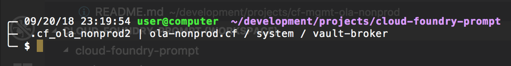

# cloud-foundry-prompt

  

Enhances your command prompt to display the currently targeted CF_HOME, foundation, org, and space.
The information is presented the way most prompts display the current working directory.

The code was originally written as a custom plugin and theme for the amazing [oh-my-zsh]. The theme was based on the existing [bira] theme.

## Displaying the Prompt
Cloud Foundry info is only added to the prompt when you are in a directory that has Cloud Foundry stuff in it.
*   any folder containing `manifest*.yml`
*   any folder containing `.show-cf-api-status`

## oh-my-zsh installation
Simply run `./oh-my-zsh/install-zsh.sh`

## Useful tips

The plugin works with or without `CF_HOME` set. But seriously, use the `CF_HOME` environment variable. You can stay logged in to multiple Cloud Foundry foundations and easily switch between them. More info at
[Pivotal Cloud Foundry / Getting Started with the cf cli]

## Future enhancements
*   Support other shells
*   Build this into a [homebrew] package for a clean install experience.

test item

[Pivotal Cloud Foundry / Getting Started with the cf cli]: https://docs.pivotal.io/pivotalcf/2-2/cf-cli/getting-started.html
[bira]: https://github.com/robbyrussell/oh-my-zsh/wiki/themes#bira
[oh-my-zsh]: https://github.com/robbyrussell/oh-my-zsh
[homebrew]: https://brew.sh/
